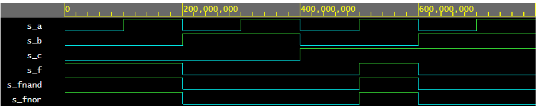
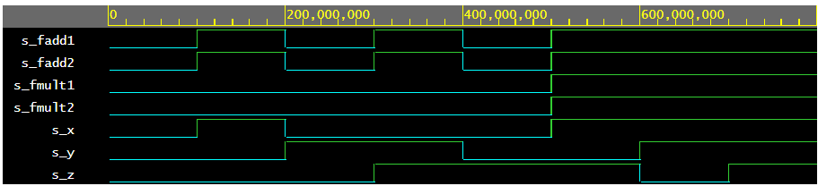

# **Lab01 - Gates**
## *De Morgan's law*

```vhdl
entity gates is
    port(
        a_i    : in  std_logic;         -- Data input
        b_i    : in  std_logic;         -- Data input
        c_i    : in  std_logic;         -- Data input
        f_o  : out std_logic;         
        fnand_o : out std_logic;         
        fnor_o : out std_logic          
    );
end entity gates;

architecture dataflow of gates is
begin
    f_o  <= ((not b_i) and a_i) or ((not c_i) and (not b_i));
    fnand_o <= not(not((not b_i) and a_i)and not((not c_i) and (not b_i)));
    fnor_o <= not(b_i or not(a_i)) or not(c_i or b_i);

end architecture dataflow;

```

| **c** | **b** |**a** | **f(c,b,a)** | **f(c,b,a)NAND** | **f(c,b,a)NOR**
| :-: | :-: | :-: | :-: | :-: | :-: |
| 0 | 0 | 0 | 1 | 1 | 1
| 0 | 0 | 1 | 1 | 1 | 1
| 0 | 1 | 0 | 0 | 0 | 0
| 0 | 1 | 1 | 0 | 0 | 0
| 1 | 0 | 0 | 0 | 0 | 0
| 1 | 0 | 1 | 1 | 1 | 1
| 1 | 1 | 0 | 0 | 0 | 0
| 1 | 1 | 1 | 0 | 0 | 0



[De Morgan](https://www.edaplayground.com/x/BE99)

## **Distributive Laws**

```vhdl
entity dist is
    port(
        x_i		: in  std_logic;
        y_i		: in  std_logic;
        z_i		: in  std_logic;
        f_mult1	: out std_logic;
        f_mult2	: out std_logic;
        f_add1	: out std_logic;
        f_add2	: out std_logic
    );
end entity dist;

architecture dataflow of dist is
begin
    f_mult1  <= (x_i and y_i) or (x_i and z_i);
    f_mult2  <= x_i and (y_i or z_i);
    f_add1  <= (x_i or y_i) and (x_i or z_i);
    f_add2  <= x_i or (y_i and z_i);

end architecture dataflow;
```



[Distributive Laws>](https://www.edaplayground.com/x/vted)
