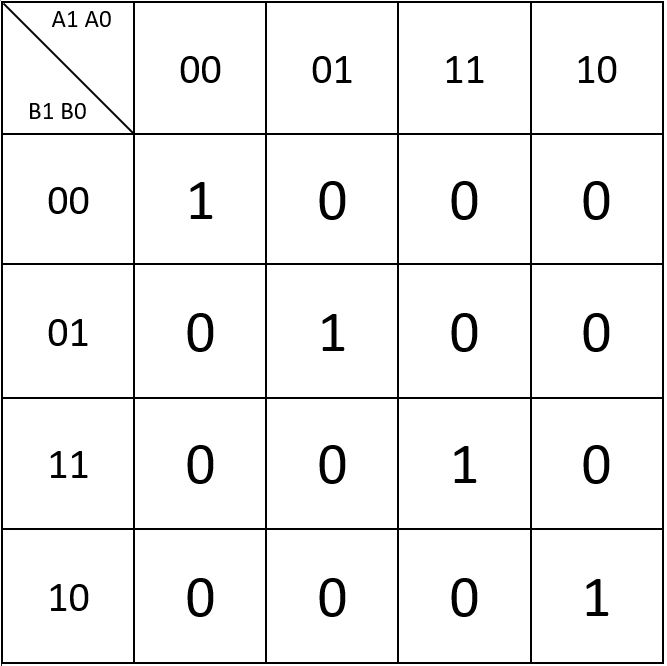
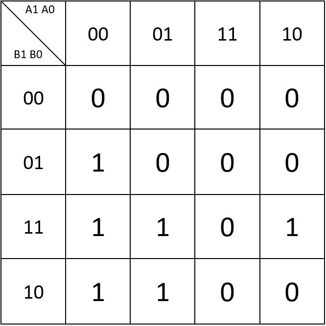
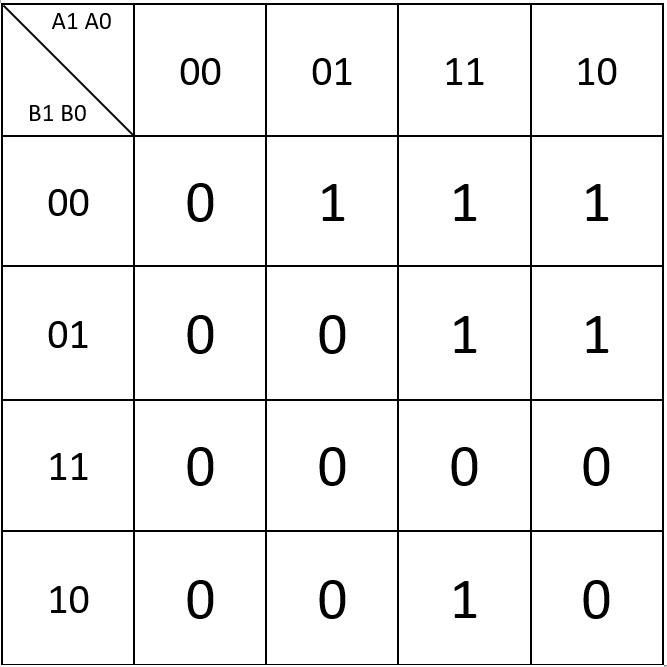
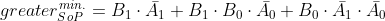
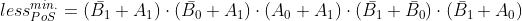

# **02 - Logic**
## **1. Logic Table**
| **Dec. equivalent** | **B[1:0]** | **A[1:0]** | **B is greater than A** | **B equals A** | **B is less than A** |
| :-: | :-: | :-: | :-: | :-: | :-: |
| 0 | 0 0 | 0 0 | 0 | 1 | 0 |
| 1 | 0 0 | 0 1 | 0 | 0 | 1 |
| 2 | 0 0 | 1 0 | 0 | 0 | 1 |
| 3 | 0 0 | 1 1 | 0 | 0 | 1 |
| 4 | 0 1 | 0 0 | 1 | 0 | 0 |
| 5 | 0 1 | 0 1 | 0 | 1 | 0 |
| 6 | 0 1 | 1 0 | 0 | 0 | 1 |
| 7 | 0 1 | 1 1 | 0 | 0 | 1 |
| 8 | 1 0 | 0 0 | 1 | 0 | 0 |
| 9 | 1 0 | 0 1 | 1 | 0 | 0 |
| 10 | 1 0 | 1 0 | 0 | 1 | 0 |
| 11 | 1 0 | 1 1 | 0 | 0 | 1 |
| 12 | 1 1 | 0 0 | 1 | 0 | 0 |
| 13 | 1 1 | 0 1 | 1 | 0 | 0 |
| 14 | 1 1 | 1 0 | 1 | 0 | 0 |
| 15 | 1 1 | 1 1 | 0 | 1 | 0 |

## **2. A 2-bit comparator**

The Karnaugh map for the equals function:



The Karnaugh map for "B is greater than A" function:



The Karnaugh map for "B is less than A" function:



Simplified equations:






Finished example EDA playground: (https://www.edaplayground.com/x/8QqQ)

# 3. **A 4-bit binary comparator**

VHDL architecture from design file:

```vhdl
-- Entity declaration for 4-bit binary comparator
------------------------------------------------------------------------
entity comparator_4bit is
    port(
        a_i           : in  std_logic_vector(4 - 1 downto 0); -- Data A
        b_i           : in  std_logic_vector(4 - 1 downto 0); -- Data B
        B_greater_A_o    : out std_logic;       -- B is greater than A
        B_equals_A_o     : out std_logic;       -- B equals A
        B_less_A_o       : out std_logic       -- B is less than A
    );
end entity comparator_4bit;

------------------------------------------------------------------------
-- Architecture body for 4-bit binary comparator
------------------------------------------------------------------------
architecture Behavioral of comparator_4bit is
begin
    B_less_A_o   <= '1' when (b_i < a_i) else '0';
    B_greater_A_o   <= '1' when (b_i > a_i) else '0';
    B_equals_A_o   <= '1' when (b_i = a_i) else '0';

end architecture Behavioral;

```

VHDL stimulus process from testbench:

```vhdl
p_stimulus : process
    begin
        -- Report a note at the begining of stimulus process
        report "Stimulus process started" severity note;


        -- First test values
        s_b <= "0000"; s_a <= "0000"; wait for 100 ns;        
        assert ((s_B_greater_A = '0') and (s_B_equals_A = '1') and (s_B_less_A = '0'))
        report "Test failed for input combination: 0000, 0000" severity error;        
        
        s_b <= "0011"; s_a <= "0101"; wait for 100 ns;
        assert ((s_B_greater_A = '0') and (s_B_equals_A = '0') and (s_B_less_A = '1'))
        report "Test failed for input combination: 0011, 0101" severity error;
        
        s_b <= "0001"; s_a <= "1001"; wait for 100 ns;
        assert ((s_B_greater_A = '0') and (s_B_equals_A = '0') and (s_B_less_A = '1'))
        report "Test failed for input combination: 0001, 1001" severity error;
        
        s_b <= "1000"; s_a <= "0110"; wait for 100 ns;
        assert ((s_B_greater_A = '1') and (s_B_equals_A = '0') and (s_B_less_A = '0'))
        report "Test failed for input combination: 1000, 0110" severity error;
        
        s_b <= "0110"; s_a <= "0110"; wait for 100 ns;
        assert ((s_B_greater_A = '0') and (s_B_equals_A = '1') and (s_B_less_A = '0'))
        report "Test failed for input combination: 0110, 0110" severity error;
        
        s_b <= "1001"; s_a <= "0101"; wait for 100 ns;
        assert ((s_B_greater_A = '1') and (s_B_equals_A = '0') and (s_B_less_A = '0'))
        report "Test failed for input combination: 1001, 0101" severity error;
        
        s_b <= "0010"; s_a <= "0100"; wait for 100 ns;
        assert ((s_B_greater_A = '0') and (s_B_equals_A = '0') and (s_B_less_A = '1'))
        report "Test failed for input combination: 0010, 0100" severity error;
        
        s_b <= "1011"; s_a <= "1011"; wait for 100 ns;
        assert ((s_B_greater_A = '0') and (s_B_equals_A = '1') and (s_B_less_A = '0'))
        report "Test failed for input combination: 1011, 1011" severity error;
        
        s_b <= "1111"; s_a <= "0000"; wait for 100 ns;
        assert ((s_B_greater_A = '1') and (s_B_equals_A = '0') and (s_B_less_A = '0'))
        report "Test failed for input combination: 1111, 0000" severity error;
        
        s_b <= "1100"; s_a <= "1101"; wait for 100 ns;
        assert ((s_B_greater_A = '0') and (s_B_equals_A = '0') and (s_B_less_A = '1'))
        report "Test failed for input combination: 1100, 1101" severity error;
        
        -- Report a note at the end of stimulus process
        report "Stimulus process finished" severity note;
        wait;
    end process p_stimulus;

end architecture testbench;

```

Listing of simulator console output with simulated error:

analyze design.vhd

analyze testbench.vhd

elaborate tb_comparator_4bit

testbench.vhd:51:9:@0ms:(report note): Stimulus process started

testbench.vhd:89:9:@900ns:(assertion error): Test failed for input combination: 1111, 0000

testbench.vhd:97:9:@1us:(report note): Stimulus process finished

Finding VCD file...

./dump.vcd


EDA playground link: (https://www.edaplayground.com/x/9bYx)