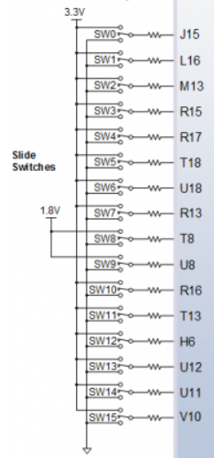
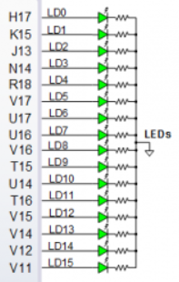
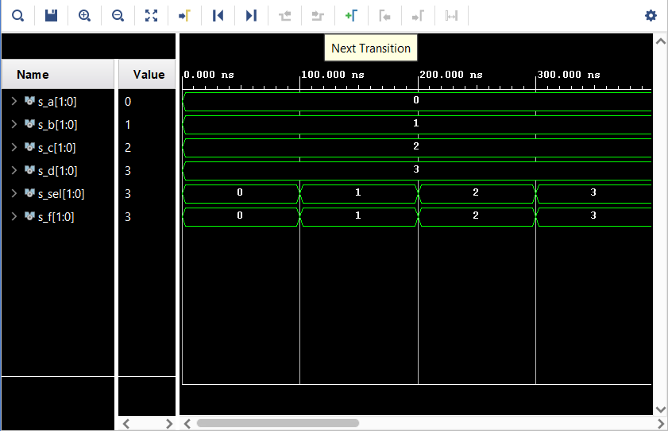

# **03 - Vivado**
## **1. Connections**

Table of switches:
| **Switch N.** | **Pin** |
| :-: | :-: |
| 0 | IO_L24N_T3_RS0_15 |
| 1 | IO_L3N_T0_DQS_EMCCLK_14 |
| 2 | IO_L6N_T0_D08_VREF_14 |
| 3 | IO_L13N_T2_MRCC_14 |
| 4 | IO_L12N_T1_MRCC_14 |
| 5 | IO_L7N_T1_D10_14 |
| 6 | IO_L17N_T2_A13_D29_14 |
| 7 | IO_L5N_T0_D07_14 |
| 8 | IO_L24N_T3_34 |
| 9 | IO_25_34 |
| 10 | IO_L15P_T2_DQS_RDWR_B_14 |
| 11 | IO_L23P_T3_A03_D19_14 |
| 12 | IO_L24P_T3_35 |
| 13 | IO_L20P_T3_A08_D24_14 |
| 14 | IO_L19N_T3_A09_D25_VREF_14 |
| 15 | IO_L21P_T3_DQS_14 |

Switches - schematic:


Table of switches:
| **Led N.** | **Pin** |
| :-: | :-: |
| 0 | IO_L18P_T2_A24_15 |
| 1 | IO_L24P_T3_RS1_15 |
| 2 | IO_L17N_T2_A25_15 |
| 3 | IO_L8P_T1_D11_14 |
| 4 | IO_L7P_T1_D09_14 |
| 5 | IO_L18N_T2_A11_D27_14 |
| 6 | IO_L17P_T2_A14_D30_14 |
| 7 | IO_L18P_T2_A12_D28_14 |
| 8 | IO_L16N_T2_A15_D31_14 |
| 9 | IO_L14N_T2_SRCC_14 |
| 10 | IO_L22P_T3_A05_D21_14 |
| 11 | IO_L15N_T2_DQS_DOUT_CSO_B_14 |
| 12 | IO_L16P_T2_CSI_B_14 |
| 13 | IO_L22N_T3_A04_D20_14 |
| 14 | IO_L20N_T3_A07_D23_14 |
| 15 | IO_L21N_T3_DQS_A06_D22_14 |


Leds - schematic:



## **2. Two-bit wide 4-to-1 multiplexer**

VHDL architecture:
```vhdl
architecture Behavioral of mux_2bit_4to1 is
begin
       f_o <= a_i when (sel_i = "00") else
              b_i when (sel_i = "01") else
              c_i when (sel_i = "10") else
              d_i;                 -- All other combinations

end Behavioral;
```

VHDL stimulus process
```vhdl
p_stimulus : process
    begin
         report "Stimulus process started" severity note;
         s_d <= "11"; s_c <= "10";s_b <= "01"; s_a <= "00";
         s_sel <= "00"; wait for 100 ns;
         s_sel <= "01"; wait for 100 ns;
         s_sel <= "10"; wait for 100 ns;
         s_sel <= "11"; wait for 100 ns;
         
         
        report "Stimulus process finished" severity note;
        wait;
    end process p_stimulus;
```

Simulated time waveforms:


## **3. Tutorial**
Novy subor:	Uz v uvodnej obrazovke je moznost, alebo file-project-new...
		    RTL project - zatial nechat tak
		    Vytvorit zdrojovy subor s rozumnym nazvom. Target language VHDL
		    Constraints - pre simulaciu v pc netreba, podstatne pri praci s realnym cipom
		    Default part - Boards, Nexys A7-50T
Uprava source file (design) 
            - v okne sources > design sources > rozkliknut source file
Testbench file: File > Add Sources > Add or create simulation sources > Create file
		    -nachadza sa v okne sources > simulation sources
Simulacia: 	Flow > Run simulation > Run Behavioral simulation