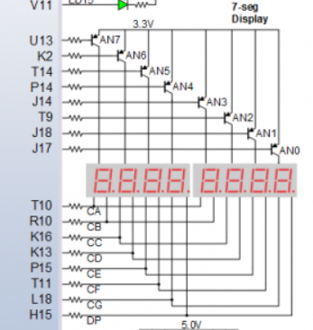
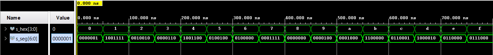
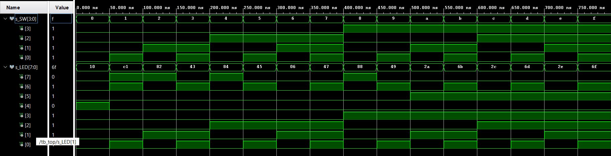

# **04 - Segment**
## **1. Tables**
Table with connection of 7-segment displays:  
| **Pin No. at 0V** | **func.** |
| :-: | :-: |
| U13 | Disp. 7 ENABLED |
| K2  | Disp. 6 ENABLED |
| T14 | Disp. 5 ENABLED |
| P14 | Disp. 4 ENABLED |
| J14 | Disp. 3 ENABLED |
| T9  | Disp. 2 ENABLED |
| J18 | Disp. 1 ENABLED |
| J17 | Disp. 0 ENABLED |
| T10 | CA ON |
| R10 | CB ON |
| K16 | CC ON |
| K13 | CD ON |
| P15 | CE ON |
| T11 | CF ON |
| L18 | CG ON |
| H16 | DP ON |

Schematic:  
  

Decoder truth table for common anode 7-segment display:  
| **Hex** | **Inputs** | **A** | **B** | **C** | **D** | **E** | **F** | **G** |
| :-: | :-: | :-: | :-: | :-: | :-: | :-: | :-: | :-: |
| 0 | 0000 | 0 | 0 | 0 | 0 | 0 | 0 | 1 |
| 1 | 0001 | 1 | 0 | 0 | 1 | 1 | 1 | 1 |
| 2 | 0010 | 0 | 0 | 1 | 0 | 0 | 1 | 0 |
| 3 | 0011 | 0 | 0 | 0 | 0 | 1 | 1 | 0 |
| 4 | 0100 | 1 | 0 | 0 | 1 | 1 | 0 | 0 |
| 5 | 0101 | 0 | 1 | 0 | 0 | 1 | 0 | 0 |
| 6 | 0110 | 0 | 1 | 0 | 0 | 0 | 0 | 0 |
| 7 | 0111 | 0 | 0 | 0 | 1 | 1 | 1 | 1 |
| 8 | 1000 | 0 | 0 | 0 | 0 | 0 | 0 | 0 |
| 9 | 1001 | 0 | 0 | 0 | 0 | 1 | 0 | 0 |
| A | 1010 | 0 | 0 | 0 | 1 | 0 | 0 | 0 |
| b | 1011 | 1 | 1 | 0 | 0 | 0 | 0 | 0 |
| C | 1100 | 0 | 1 | 1 | 0 | 0 | 0 | 1 |
| d | 1101 | 1 | 0 | 0 | 0 | 0 | 1 | 0 |
| E | 1110 | 0 | 1 | 1 | 0 | 0 | 0 | 0 |
| F | 1111 | 0 | 1 | 1 | 1 | 0 | 0 | 0 |
  
## **2. Seven-segment display decoder**
  
VHDL architecture from source file hex_7seg.vhd:  
```vhdl
p_7seg_decoder : process(hex_i)
    begin
        case hex_i is
            when "0000" =>
                seg_o <= "0000001";     -- 0
            when "0001" =>
                seg_o <= "1001111";     -- 1
            when "0010" =>
                seg_o <= "0010010";     -- 2
            when "0011" =>
                seg_o <= "0000110";     -- 3
            when "0100" =>
                seg_o <= "1001100";     -- 4
            when "0101" =>
                seg_o <= "0100100";     -- 5
            when "0110" =>
                seg_o <= "0100000";     -- 6
            when "0111" =>
                seg_o <= "0001111";     -- 7
            when "1000" =>
                seg_o <= "0000000";     -- 8
            when "1001" =>
                seg_o <= "0000100";     -- 9
            when "1010" =>
                seg_o <= "0001000";     -- A
            when "1011" =>
                seg_o <= "1100000";     -- b
            when "1100" =>
                seg_o <= "0110001";     -- C
            when "1101" =>
                seg_o <= "1000010";     -- d
            when "1110" =>
                seg_o <= "0110000";     -- E
            when others =>
                seg_o <= "0111000";     -- F
        end case;
    end process p_7seg_decoder;
```  
VHDL stimulus process from testbench file tb_hex_7seg.vhd:  

```vhdl
p_stimulus : process
    begin
        -- Report a note at the begining of stimulus process
        report "Stimulus process started" severity note;

        s_hex <= "0000"; wait for 50 ns;
        s_hex <= "0001"; wait for 50 ns;
        s_hex <= "0010"; wait for 50 ns;
        s_hex <= "0011"; wait for 50 ns;
        s_hex <= "0100"; wait for 50 ns;
        s_hex <= "0101"; wait for 50 ns;
        s_hex <= "0110"; wait for 50 ns;
        s_hex <= "0111"; wait for 50 ns;
        s_hex <= "1000"; wait for 50 ns;
        s_hex <= "1001"; wait for 50 ns;
        s_hex <= "1010"; wait for 50 ns;
        s_hex <= "1011"; wait for 50 ns;
        s_hex <= "1100"; wait for 50 ns;
        s_hex <= "1101"; wait for 50 ns;
        s_hex <= "1110"; wait for 50 ns;
        s_hex <= "1111"; wait for 50 ns;    
        
        -- Report a note at the end of stimulus process
        report "Stimulus process finished" severity note;
        wait;
    end process p_stimulus;
```  
  
Screenshot with simulated time waveforms:  


VHDL code from source file top.vhd with 7-segment module instantiation:  
```vhdl
hex2seg : entity work.hex_7seg
        port map(
            hex_i    => SW,
            seg_o(6) => CA,
            seg_o(5) => CB,
            seg_o(4) => CC,
            seg_o(3) => CD,
            seg_o(2) => CE,
            seg_o(1) => CF,
            seg_o(0) => CG
        );
```  

## **3. LED(7:4) indicators**  
  
Truth table for LEDs(7:4):  
| **Hex** | **Inputs** | **LED4** | **LED5** | **LED6** | **LED7** |
| :-: | :-: | :-: | :-: | :-: | :-: |
| 0 | 0000 | 1 | 0 | 0 | 0 |
| 1 | 0001 | 0 | 0 | 1 | 1 |
| 2 | 0010 | 0 | 0 | 0 | 1 |
| 3 | 0011 | 0 | 0 | 1 | 0 |
| 4 | 0100 | 0 | 0 | 0 | 1 |
| 5 | 0101 | 0 | 0 | 1 | 0 |
| 6 | 0110 | 0 | 0 | 0 | 0 |
| 7 | 0111 | 0 | 0 | 1 | 0 |
| 8 | 1000 | 0 | 0 | 0 | 1 |
| 9 | 1001 | 0 | 0 | 1 | 0 |
| A | 1010 | 0 | 1 | 0 | 0 |
| b | 1011 | 0 | 1 | 1 | 0 |
| C | 1100 | 0 | 1 | 0 | 0 |
| d | 1101 | 0 | 1 | 1 | 0 |
| E | 1110 | 0 | 1 | 0 | 0 |
| F | 1111 | 0 | 1 | 1 | 0 |  

VHDL code for LEDs(7:4):  
```vhdl
-- Display input value on LEDs
    LED(3 downto 0) <= SW;

-- LED(7:4) indicators
    -- Turn LED(4) on if input value is equal to 0, ie "0000"
    LED4 : process (SW)
        begin
            if (SW = "0000") then
                LED(4) <= '1';
            else
                LED(4) <= '0';
            end if;
        end process LED4;
    
    -- Turn LED(5) on if input value is greater than "1001", ie 9
    LED5 : process (SW)
        begin
            if (SW > b"1001") then
                LED(5) <= '1';
            else
                LED(5) <= '0';
            end if;
        end process LED5;
    
    -- Turn LED(6) on if input value is odd, ie 1, 3, 5, ...
    LED6 : process (SW)
        begin
            if (SW(0) = '1') then
                LED(6) <= '1';
            else
                LED(6) <= '0';
            end if;
        end process LED6;
        
    -- Turn LED(7) on if input value is a power of two, ie 1, 2, 4, or 8
    LED7 : process (SW)
        begin             
            case SW is
                when "0001" =>
                LED(7) <= '1';
                when "0010" =>
                LED(7) <= '1';
                when "0100" =>
                LED(7) <= '1';
                when "1000" =>
                LED(7) <= '1';
                when others =>
                LED(7) <= '0';
            end case;
        end process LED7;   
```  
Screenshot with simulated time waveforms:  
