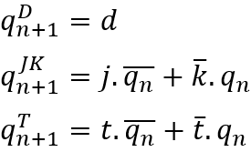
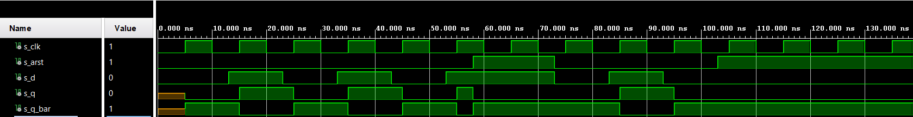
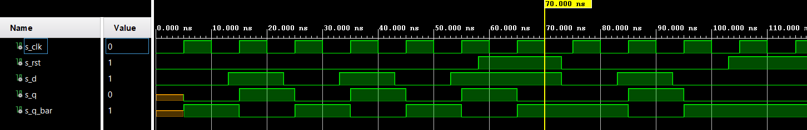
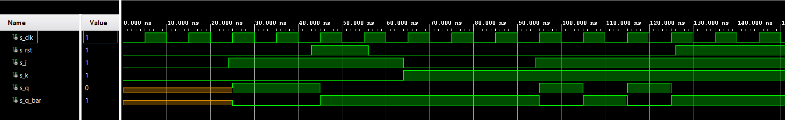
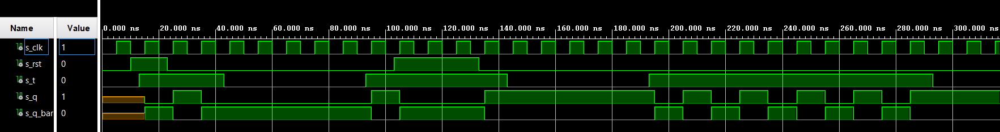

# **07 - Latches and Flip-flops**
## **1. Characteristic equations and completed tables for D, JK, T flip-flops**  
Characteristic equations:


| **clk** | **d** | **q(n)** | **q(n+1)** | **Comments** |
| :-: | :-: | :-: | :-: | :-- |
|  | 0 | 0 | 0 | Remember/hold values, no change |
|  | 0 | 1 | 0 | Input signal is sampled at the rising edge of clk and stored to FF |
|  | 1 | 0 | 1 | Input signal is sampled at the rising edge of clk and stored to FF |
|  | 1 | 1 | 1 | Remember/hold values, no change |
     
| **clk** | **j** | **k** | **q(n)** | **q(n+1)** | **Comments** |
| :-: | :-: | :-: | :-: | :-: | :-- |
|  | 0 | 0 | 0 | 0 | No change |
|  | 0 | 0 | 1 | 1 | No change |
|  | 0 | 1 | 0 | 0 | Reset |
|  | 0 | 1 | 1 | 0 | Reset |
|  | 1 | 0 | 0 | 1 | Set |
|  | 1 | 0 | 1 | 1 | Set |
|  | 1 | 1 | 0 | 1 | Toggle |
|  | 1 | 1 | 1 | 0 | Toggle |
  
| **clk** | **t** | **q(n)** | **q(n+1)** | **Comments** |
| :-: | :-: | :-: | :-: | :-- |
|  | 0 | 0 | 0 | No change |
|  | 0 | 1 | 1 | No change |
|  | 1 | 0 | 1 | Invert (Toggle) |
|  | 1 | 1 | 0 | Invert (Toggle) |

## **2. D latch**
VHDL code listing of the process p_d_latch:
```vhdl
p_d_latch : process (d, arst, en)
begin
    if (arst = '1') then
        q <= '0';
        q_bar <= '1';
    elsif (en = '1') then
        q <= d;
        q_bar <= not d;        
    end if;
end process p_d_latch;
```  
Listing of VHDL reset and stimulus processes from the testbench tb_d_latch.vhd file:  
```vhdl
p_stimulus : process
    begin
        report "Stimulus process started" severity note;

        s_en <= '0';
        s_d <= '0';
        
        --d sequence
        wait for 10ns;
        s_d <= '1';
        wait for 10ns;
        s_d <= '0';
        wait for 10ns;
        s_d <= '1';
        wait for 10ns;
        s_d <= '0';
        wait for 10ns;
        s_d <= '1';
        wait for 10ns;
        s_d <= '0';
        wait for 10ns;
        s_d <= '1';
        wait for 10ns;
        s_d <= '0';
        
        s_en <= '1';
        
        wait for 3ns;
        assert(s_q = '0' and s_q_bar = '1')
        report "chyba" severity error;
        
        --d sequence
        wait for 7ns;
        s_d <= '1';
        wait for 10ns;
        s_d <= '0';
        wait for 10ns;
        s_d <= '1';
        wait for 10ns;
        s_d <= '0';
        wait for 10ns;
        s_d <= '1';
        wait for 10ns;
        s_d <= '0';
        wait for 10ns;
        s_d <= '1';
        wait for 5ns;
        s_en <= '0';
        wait for 5ns;
        s_d <= '0';
        assert(s_q = '1' and s_q_bar = '0')
        report "chyba latch" severity error;
        
        --d sequence
        wait for 10ns;
        s_d <= '1';
        wait for 10ns;
        s_d <= '0';
        wait for 10ns;
        s_d <= '1';
        wait for 10ns;
        s_d <= '0';
        wait for 10ns;
        s_d <= '1';
        wait for 10ns;
        s_d <= '0';
       
        s_en <= '1';
        

        report "Stimulus process finished" severity note;
        wait;
    end process p_stimulus;
```  
Screenshot with simulated time waveforms:  
  
## **3. Flip-flops**  

VHDL code listing of the processes for D type flip-flop with an async reset:
```vhdl
p_d_ff_arst : process (clk, arst)
begin
    if (arst = '1') then
        q     <= '0';
        q_bar <= '1';
    elsif rising_edge(clk) then
        q     <= d;
        q_bar <= not d;        
    end if;
end process p_d_ff_arst;
```  

VHDL code listing of the processes for D type flip-flop with a sync reset:
```vhdl
p_d_ff_rst : process (clk, rst)
begin
    
    if rising_edge(clk) then
        if (rst = '1') then
        q     <= '0';
        q_bar <= '1';
        else 
        q     <= d;
        q_bar <= not d;
        end if;        
    end if;
end process p_d_ff_rst;
```

Listing of VHDL clock, reset and stimulus processes from the testbench file for both D type flip-flops:
```vhdl
p_clk_gen : process
    begin
        while now < 1000 ns loop
            s_clk <= '0';
            wait for c_CLK_PERIOD / 2;
            s_clk <= '1';
            wait for c_CLK_PERIOD / 2;
        end loop;
        wait;
    end process p_clk_gen;

p_reset_gen : process
    begin
        s_arst <= '0';
        wait for 58 ns;        
        s_arst <= '1';
        wait for 10 ns;
        assert(s_q = '0' and s_q_bar = '1')
        report "reset error" severity error;
        wait for 5 ns;
        s_arst <= '0';
        wait for 30 ns;
        s_arst <= '1';
        wait;
    end process p_reset_gen;
       
p_stimulus : process
    begin
        report "Stimulus process started" severity note;
        s_d <= '0';
        wait for 13ns;
        s_d <= '1';
        wait for 10ns;
        s_d <= '0';
        wait for 5ns;
        assert(s_q = '0' and s_q_bar = '1')
        report "ff error" severity error;
        wait for 5 ns;            
        s_d <= '1';
        wait for 5ns;
        assert(s_q = '1' and s_q_bar = '0')
        report "ff error" severity error;
        wait for 5 ns;
        s_d <= '0';
        wait for 10ns;
        s_d <= '1';
        wait for 10ns;
        s_d <= '1';
        wait for 10ns;
        s_d <= '0';
        wait for 10ns;
        s_d <= '1';
        wait for 10ns;
        s_d <= '0';
        
        report "Stimulus process finished" severity note;
        wait;
    end process p_stimulus;
```  
*"arst" changes to "rst" and vice versa  

Screenshot with simulated time waveforms for D type flip-flop with an async reset:  
  

Screenshot with simulated time waveforms for D type flip-flop with a sync reset:  

  
VHDL code listing for JK type flip-flop with a sync reset:

```vhdl
architecture Behavioral of jk_ff_rst is
    signal s_q : std_logic;
begin

    p_jk_ff_rst : process (clk)
    begin
        if rising_edge(clk) then
            if (rst = '1') then
                 s_q <= '0';
            else
                if (j = '0' and k = '0') then
                    s_q <= s_q;
                elsif (j = '1' and k = '0') then
                    s_q <= '1';
                elsif (j = '0' and k = '1') then
                    s_q <= '0';
                elsif (j = '1' and k = '1') then
                    s_q <= not s_q;  
                end if;
            end if;      
        end if;
    end process p_jk_ff_rst;

    q <= s_q;
    q_bar <= not s_q;
    
end Behavioral;
```  

Listing of VHDL clock, reset and stimulus processes from the testbench file for JK type flip-flop:
```vhdl
    p_clk_gen : process
        begin
            while now < 1000 ns loop
                s_clk <= '0';
                wait for c_CLK_PERIOD / 2;
                s_clk <= '1';
                wait for c_CLK_PERIOD / 2;
            end loop;
            wait;
        end process p_clk_gen;
    
    p_reset_gen : process
        begin
            s_rst <= '0';
            wait for 43 ns;        
            s_rst <= '1';
            wait for 10ns;
            assert(s_q = '0' and s_q_bar = '1')
            report "reset error" severity error;
            wait for 3 ns;
            s_rst <= '0';
            wait for 70 ns;
            s_rst <= '1';
            wait;
        end process p_reset_gen;
           
    p_stimulus : process
        begin
            report "Stimulus process started" severity note;
            s_j <= '0';
            s_k <= '0';
            wait for 24ns;
            s_j <= '1';
            s_k <= '0';
            wait for 5ns;
            assert(s_q = '1' and s_q_bar = '0')
            report "ff error" severity error;
            wait for 35ns;
            s_j <= '0';
            s_k <= '1';
            wait for 5ns;
            assert(s_q = '0' and s_q_bar = '1')
            report "ff error" severity error;
            wait for 35ns;
            s_j <= '1';
            s_k <= '1';
            wait for 30ns;       
            report "Stimulus process finished" severity note;
            wait;
        end process p_stimulus;
``` 
*"arst" changes to "rst" and vice versa

Screenshot with simulated time waveforms for JK type flip-flop with a sync reset:  
  

VHDL code listing of the processes for T type flip-flop with a sync reset:
```vhdl
architecture Behavioral of t_ff_rst is
    signal s_q : std_logic;
begin
    p_d_ff_rst : process (clk, rst)
    begin        
        if rising_edge(clk) then
            if (rst = '1') then
            s_q     <= '0';
            elsif (t = '1') then 
            s_q     <= not s_q;
            else
            s_q     <= s_q;
            end if;        
        end if;
    end process p_d_ff_rst;
    q     <= s_q;
    q_bar <= s_q;
end Behavioral;
```
  
Listing of VHDL clock, reset and stimulus processes from the testbench file for T type flip-flop:
```vhdl
p_clk_gen : process                                                            
    begin                                                                      
        while now < 1000 ns loop                                               
            s_clk <= '0';                                                      
            wait for c_CLK_PERIOD / 2;                                         
            s_clk <= '1';                                                      
            wait for c_CLK_PERIOD / 2;                                         
        end loop;                                                              
        wait;                                                                  
    end process p_clk_gen;                                                     
                                                                               
p_reset_gen : process                                                          
    begin                                                                      
        s_rst <= '0';                                                          
        wait for 10 ns;                                                        
        s_rst <= '1';                                                          
        wait for 13 ns;                                                        
        s_rst <= '0';                                                          
        wait for 80 ns;                                                        
        s_rst <= '1';                                                          
        wait for 10ns;                                                         
        assert(s_q = '0' and s_q_bar = '1')                                    
        report "reset error" severity error;                                   
        wait for 20 ns;                                                        
        s_rst <= '0';                                                          
        wait;                                                                  
    end process p_reset_gen;                                                   
                                                                               
p_stimulus : process                                                           
    begin                                                                      
        report "Stimulus process started" severity note;                       
        s_t <= '0';                                                            
        wait for 13ns;                                                         
        s_t <= '1';                                                            
        wait for 30ns;                                                         
        s_t <= '0';                                                            
        wait for 50ns;                                                         
        s_t <= '1';                                                            
        wait for 50ns;                                                         
        s_t <= '0';                                                            
        wait for 50ns;                                                         
        s_t <= '1';                                                            
        wait for 50ns;                                                         
        s_t <= '1';                                                            
        wait for 50ns;                                                         
        s_t <= '0';                                                            
                                                                               
        report "Stimulus process finished" severity note;                      
        wait;                                                                  
    end process p_stimulus;                                                    
```  

Screenshot with simulated time waveforms for T type flip-flop with a sync reset:  
  

## **4. Shift register**

Image of the shift register schematic:

