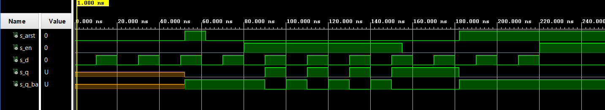

# **07 - Latches and Flip-flops**
## **1. Characteristic equations and completed tables for D, JK, T flip-flops**  
| **D** | **Qn** | **Q(n+1)** | **Comments** |
   | :-: | :-: | :-: | :-- |
   | 0 | 0 |  |  |
   | 0 | 1 |  |  |
   | 1 |  |  |  |
   | 1 |  |  |  |
     
| **J** | **K** | **Qn** | **Q(n+1)** | **Comments** |
   | :-: | :-: | :-: | :-: | :-- |
   | 0 | 0 | 0 | 0 | No change |
   | 0 | 0 | 1 | 1 | No change |
   | 0 | 1 | 0 | 0 | Reset |
   | 0 | 1 | 1 | 0 | Reset |
   | 1 | 0 | 0 | 1 | Set |
   | 1 | 0 | 1 | 1 | Set |
   | 1 | 1 | 0 | 1 | Toggle |
   | 1 | 1 | 1 | 0 | Toggle |
     
| **T** | **Qn** | **Q(n+1)** | **Comments** |
   | :-: | :-: | :-: | :-- |
   | 0 | 0 |  |  |
   | 0 | 1 |  |  |
   | 1 |  |  |  |
   | 1 |  |  |  |
     
## **2. D latch**
VHDL code listing of the process p_d_latch:
```vhdl
p_d_latch : process (d, arst, en)
begin
    if (arst = '1') then
        q <= '0';
        q_bar <= '1';
    elsif (en = '1') then
        q <= d;
        q_bar <= not d;        
    end if;
end process p_d_latch;
```  
Listing of VHDL reset and stimulus processes from the testbench tb_d_latch.vhd file:  
```vhdl
p_reset_gen : process
           begin
               s_arst <= '0';
               wait for 52 ns;
               s_arst <= '1';
               wait for 10 ns;
               s_arst <= '0';
               wait for 120 ns;
               s_arst <= '1';
               wait;
           end process p_reset_gen;
        
        p_stimulus : process
            begin
                report "Stimulus process started" severity note;
        
                s_en <= '0';
                s_d <= '0';
                
                --d sequence
                wait for 10ns;
                s_d <= '1';
                wait for 10ns;
                s_d <= '0';
                wait for 10ns;
                s_d <= '1';
                wait for 10ns;
                s_d <= '0';
                wait for 10ns;
                s_d <= '1';
                wait for 10ns;
                s_d <= '0';
                wait for 10ns;
                s_d <= '1';
                wait for 10ns;
                s_d <= '0';
                
                s_en <= '1';
                
                --d sequence
                wait for 10ns;
                s_d <= '1';
                wait for 10ns;
                s_d <= '0';
                wait for 10ns;
                s_d <= '1';
                wait for 10ns;
                s_d <= '0';
                wait for 10ns;
                s_d <= '1';
                wait for 10ns;
                s_d <= '0';
                wait for 10ns;
                s_d <= '1';
                wait for 5ns;
                s_en <= '0';
                wait for 5ns;
                s_d <= '0';
                
                --d sequence
                wait for 10ns;
                s_d <= '1';
                wait for 10ns;
                s_d <= '0';
                wait for 10ns;
                s_d <= '1';
                wait for 10ns;
                s_d <= '0';
                wait for 10ns;
                s_d <= '1';
                wait for 10ns;
                s_d <= '0';
               
                s_en <= '1';
                
        
                report "Stimulus process finished" severity note;
                wait;
            end process p_stimulus;
```  
Screenshot with simulated time waveforms:  
  
## **3. Flip-flops**  


```vhdl
```

```vhdl
```

```vhdl
```

```vhdl
```